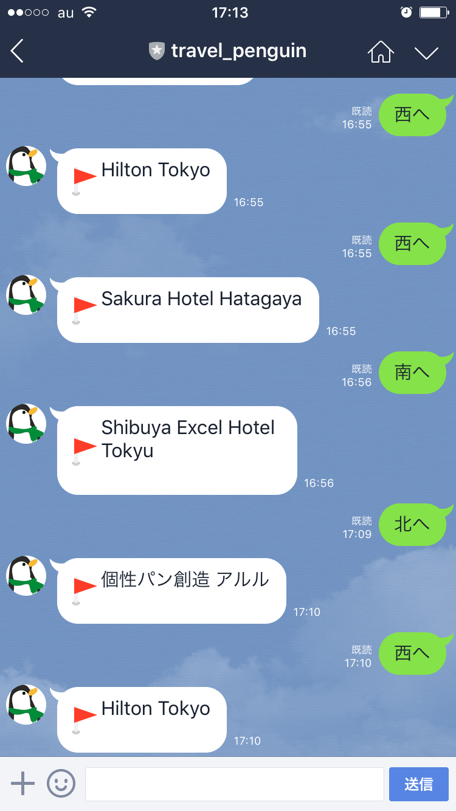
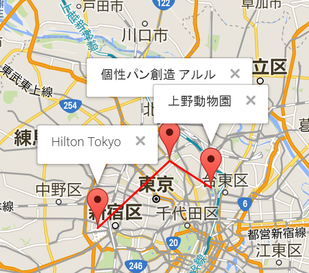

# Travel Penguin Bot

Travel Penguin is LINE bot that travels over the worlds!

# How to use

## 1. Add Travel Penguin to your LINE friend.

## 2. Direct the travel direction to the Penguin.

examples (some adjectives ("ちょっと"、"すごく" etc) is allowed)

* 北へ行って
* すごく南西へ
* とりあえず北東へ旅して

Then, Penguin will travel to directed direction.

## 3. See Travel History.

You can see the Penguin's travel history from here.

[Travel Penguin History](https://travelpenguin.herokuapp.com/)

